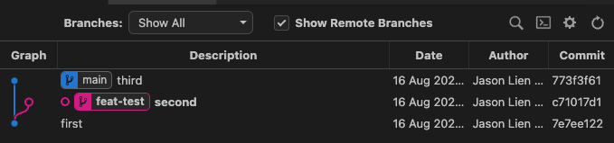
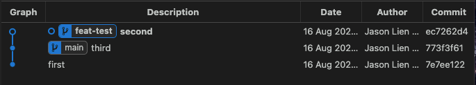
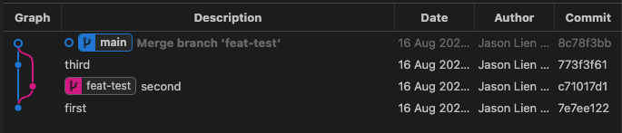
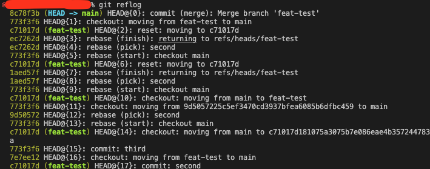

# git 操作

情境：當開發新功能，從分支**main**切出分支**feat-test**，提交了 Commit :c71017d，分支**main**也有了新的 Commit:773f3f6 紀錄。


## 第一種合併:使用 git rebase

```shell
git checkout feat-test

git rebase main
```

操作結果可以看到，rebase 動作將 Commit :c71017d 給轉換成 Commit: ec7262d，再加入回分支**main**。


## 第二種合併:使用 git merge

```shell
git checkout main

git merge feat-test
```

操作結果可以看到，merge 動作將 Commit :c71017d 改動併入了分支**main**，產生一個新的 Commit: 8c78f3bb。且分支**feat-test**的 Commit :c71017d 是留存在分支上，可以檢視完整的 commit 時序。


## undo git 操作

情境：不管使用 rebase 或 merge 動作，反悔了想要重做

```shell
git reflog

git reset --hard ${commit_hash}
```

首先查看 git 的操作記錄，再指定要回到的 Commit，就可以達成重做的效果。

