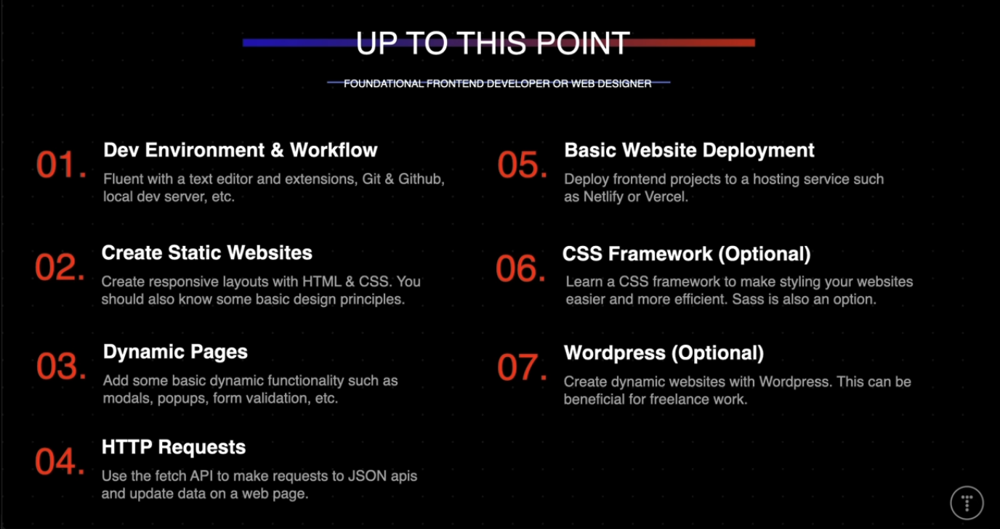
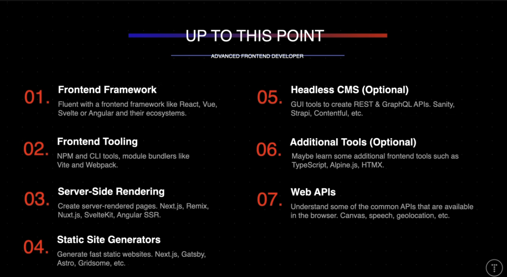

# 2024 網頁開發的知識重點

## 前端

1. 開發環境配置和工作流的掌握
2. 靜態頁面製作
3. 頁面互動效果
4. 通訊協定的機制
5. 應用部署的工具
6. css撰寫的輔助框架
7. 日漸過時，但還是存在的Workpress

1. Svelte已經被作者納入主流框架
2. Vite發展穩定
3. SSR的技術知識
4. SSR的框架
5. 使用headless CMS控管網站內容/資料 
6. 要做複雜且龐大的系統 可以選用的工具 像是TypeScript
7. 瀏覽器提供強大的API需要掌握

----
Reference:
[Web Development In 2024 - A Practical Guide](https://www.youtube.com/watch?v=8sXRyHI3bLw&ab_channel=TraversyMedia )