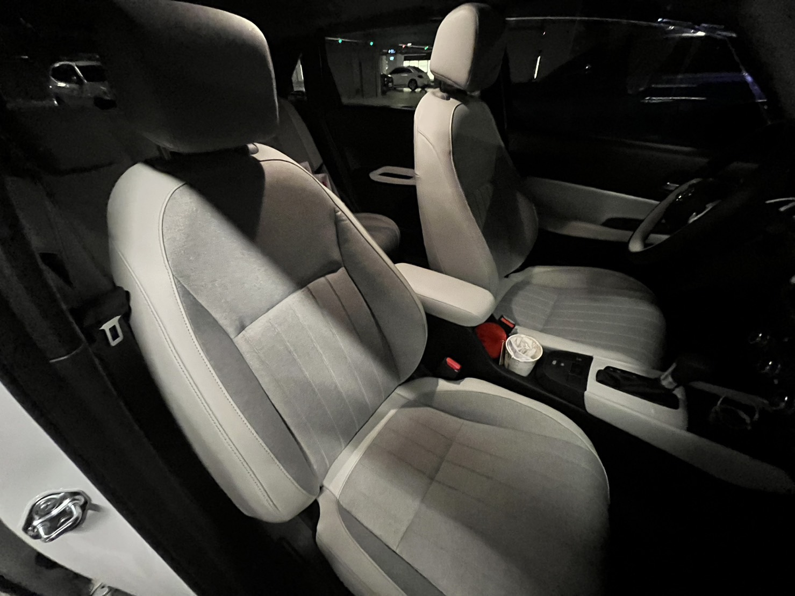
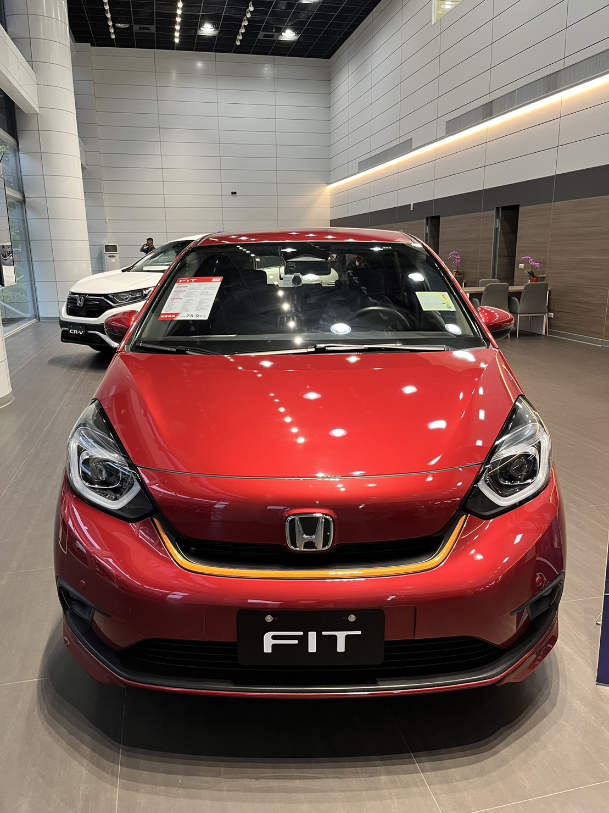
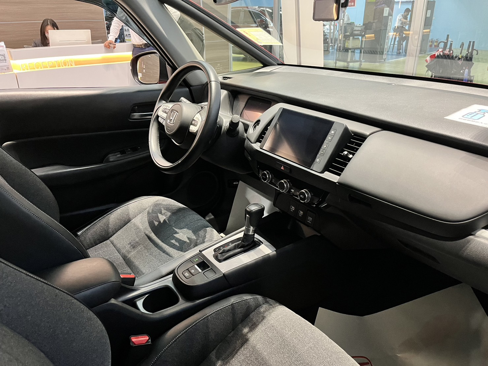
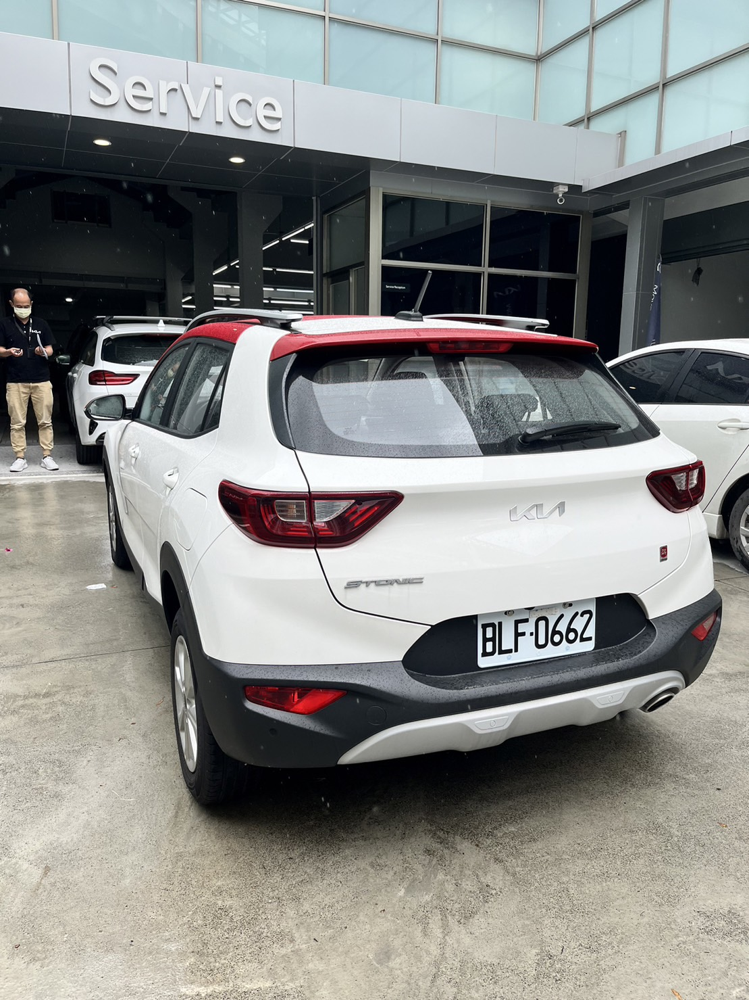
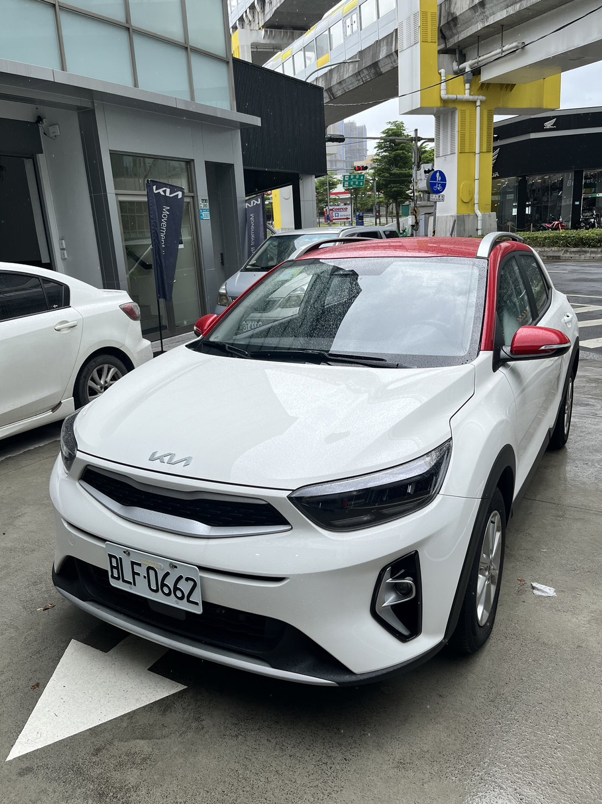
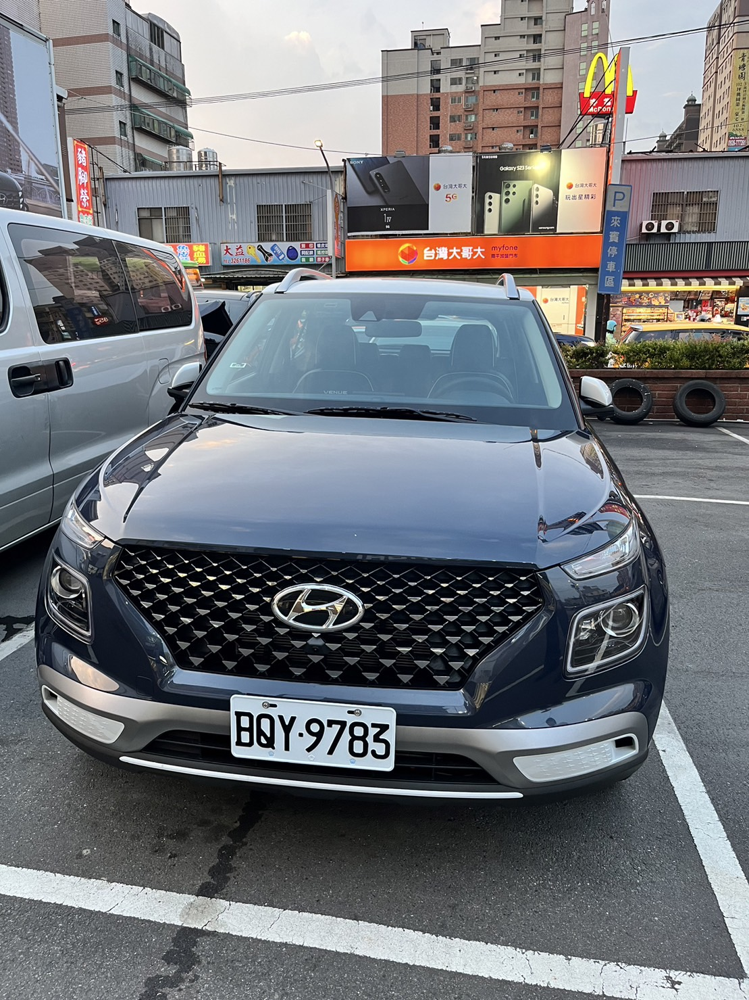
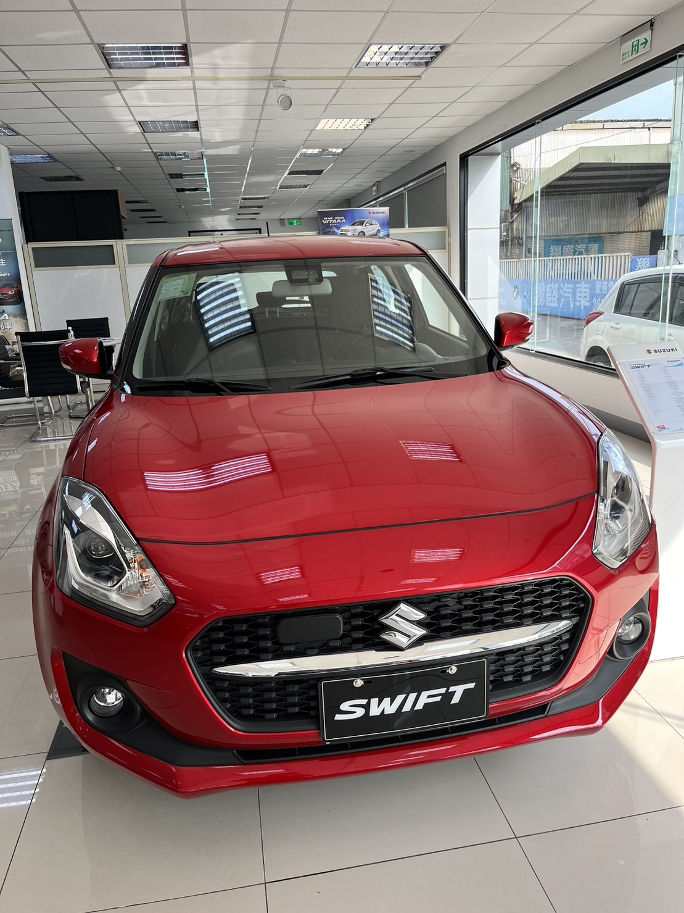

# Honda fit e:hev @中和交車中心

## 🚘️ Honda fit e:hev 交車

<Flexbox justify='flex-start' gap='20px' class='imgMax my-2'>

2023，7月16日，炎熱的高溫! 賀交車~~~啦! 🎉🎉     
等車的時間大概是兩個月，因為選了白內裝，多等了一個月，質感上是真的不錯~!    
配件部分只選了隔熱紙、倒車顯影(副廠)和晴雨窗(原廠)，大概這樣快2萬。    
開了幾天的幾項體感:    
1. 行路感受和之前那台的2.5 Teana相比，都不會有過多彈跳，且高速車身很穩。但Teana v6給的動力，還是真的在高速時略勝一籌 
2. 內裝座椅上，椅子坐起來都不錯，Teana的椅子還是電動操作，fit則是純手動 
3. 音響感受上，由於兩台隔音都好，所以明顯覺得Teana的音響比較好一些些 
4. 輔助功能，fit多了車道維持，兩台都有定速，但這些輔助功能其實我都沒習慣用，所以無感，甚至覺得要是這些都沒有也行 
5. 之油耗表現，這應該是完勝2.5 Teana極大的一點，自從開始通勤到機場附近上班，每天來回60km，油錢大概1200元，而fit聽說是可以讓你忘記你上次是什麼時候加油...XD，後續再觀察一下。 

</Flexbox>

## 其它試駕的車子

<Flexbox justify='flex-start' gap='20px' class='imgMax my-2'>

</Flexbox>

大概是今年 5 月初開始去展間約試駕，包含 fit 汽油版，kia stonic 汽油、hyundai venue、suzuki swift 這幾台。只能說開過 2.5 Teana 換到小車都還蠻明顯有不習慣感。

swift 主要是上高速會飄，真有點怕; stonic 在換檔多了頓感;venue 怠速時有明顯的抖動...。我最後是在 fit 汽油跟油電版選擇。

還是要勸世一下，fit e:hev 價格上跟其他小車大概多了 10 萬，但車體剛性跟安全性應該不是這台的強項。如果對自身駕駛經驗和運氣有較高的信心，那 fit e:hev 是真不錯的選擇，白內裝就看個人吧!

