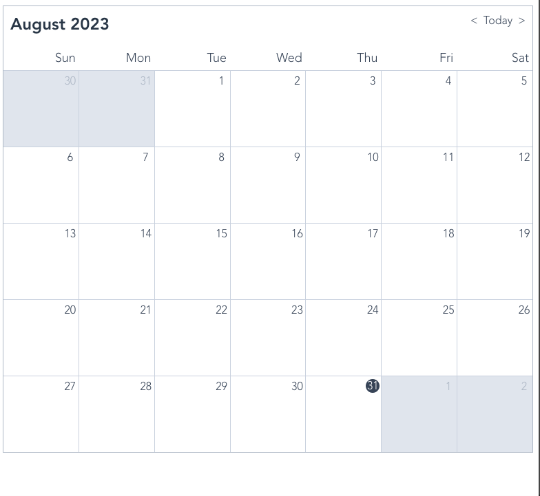
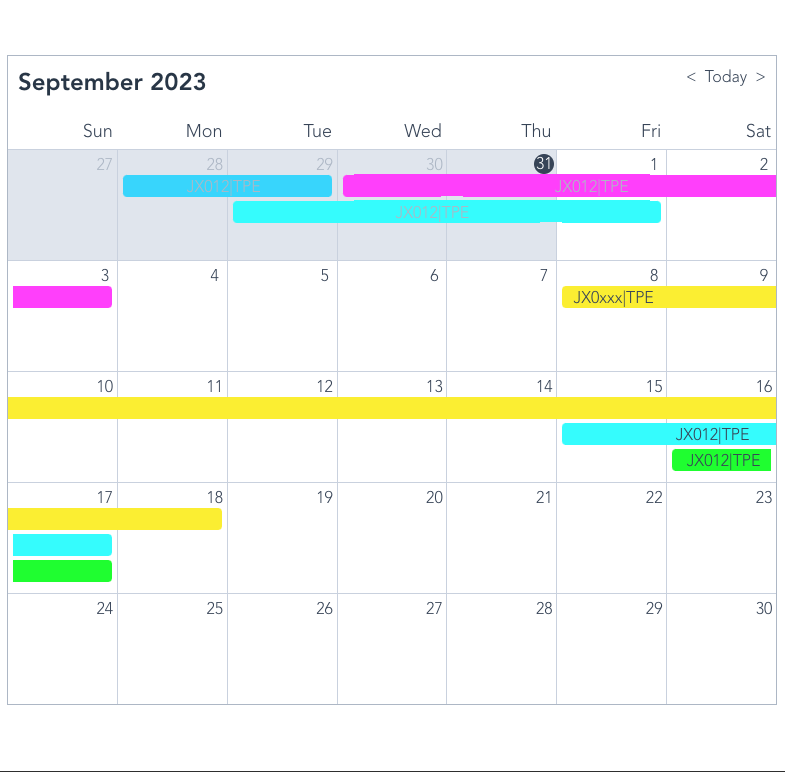
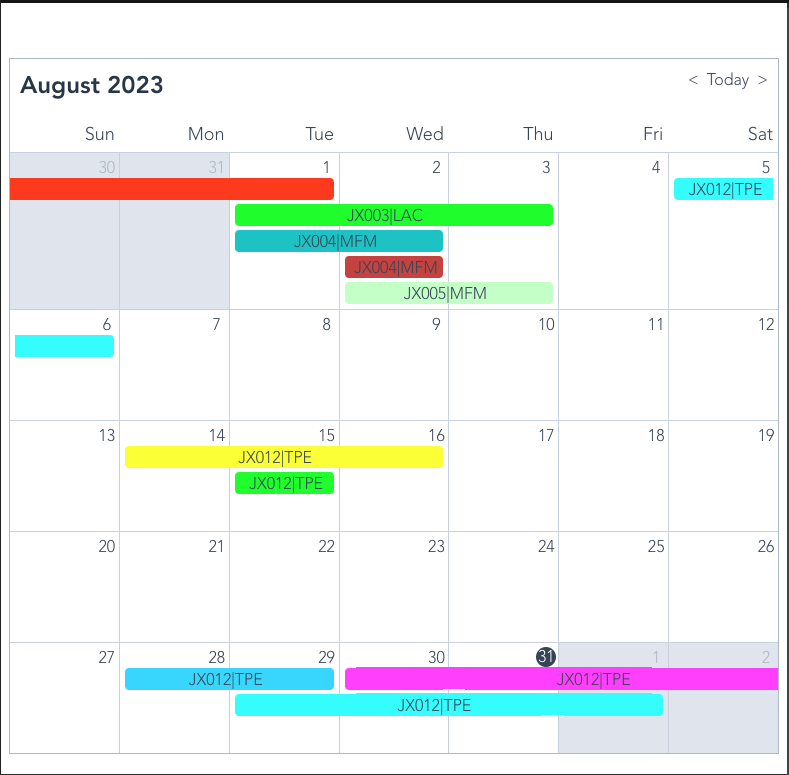

# 30 天日曆班表顯示

工作上遇到的需求，使用者需要在畫面顯示當月的排班。技術上，可以先拆解成日曆部分和顯示班表兩項，前者在[codesanbox](https://codesandbox.io/discover)找到一些範例，後者則需要思考要怎麼做到任務顯示。

## 日曆顯示

找到的範例是使用 vue2、daysjs 和 grid 排版方式完成，有基本切換前後月份的功能



## 目標結果

每一個班表可能會有跨多天的情況，要在每一個日期格子內判斷班表要呈現的狀態，包含：是第一天、是任務期間、是最後一天，來決定要顯示的樣式。樣式部分利用了::before ::affter 把跨日期的區塊補上。





## 計算出每一天的任務陣列

這裡做的事情，是把每一天的任務做重新排序(換位置)，這樣可以讓任務在換天時能在同一個水平線。

```javascript
daysTasks() {
  const daysDate = this.days.map((day) => day.date);
  const daysTask = daysDate.map((date) => {
    const dayTaskArr = this.roster //班表資料
      .filter((task) =>
        this.getIsInTaskDuration(date, task.start, task.end)
      )
      .map((task) => {
        return { ...task, date };
      });
    return dayTaskArr;
  });

  const formatDaysTask = [];

  daysTask.forEach((curArr, currentIndex) => {
    if (currentIndex === 0) {
      formatDaysTask.push(curArr);
      return;
    }

    let prevFormatArr = formatDaysTask[currentIndex - 1];
    let formatArr = [];

    curArr.forEach((item, idx) => {
      let inPreDayTask = prevFormatArr.find((preItem) => {
        return preItem?.id === item?.id;
      });
      if (inPreDayTask) {
        let inPreDayTaskIndex = prevFormatArr.findIndex(
          (preItem) => preItem?.id === item?.id
        );

        if (formatArr[inPreDayTaskIndex]) {
          // 換位置
          let temp = formatArr[inPreDayTaskIndex];
          formatArr[idx] = temp;
        }

        formatArr[inPreDayTaskIndex] = item;
      } else {
        if (formatArr[idx]) {
          // 換位置
          formatArr[idx + 1] = item;
          return true;
        }

        formatArr[idx] = item;
      }
    });

    formatDaysTask.push(formatArr);
  });

  return formatDaysTask;
}


```
