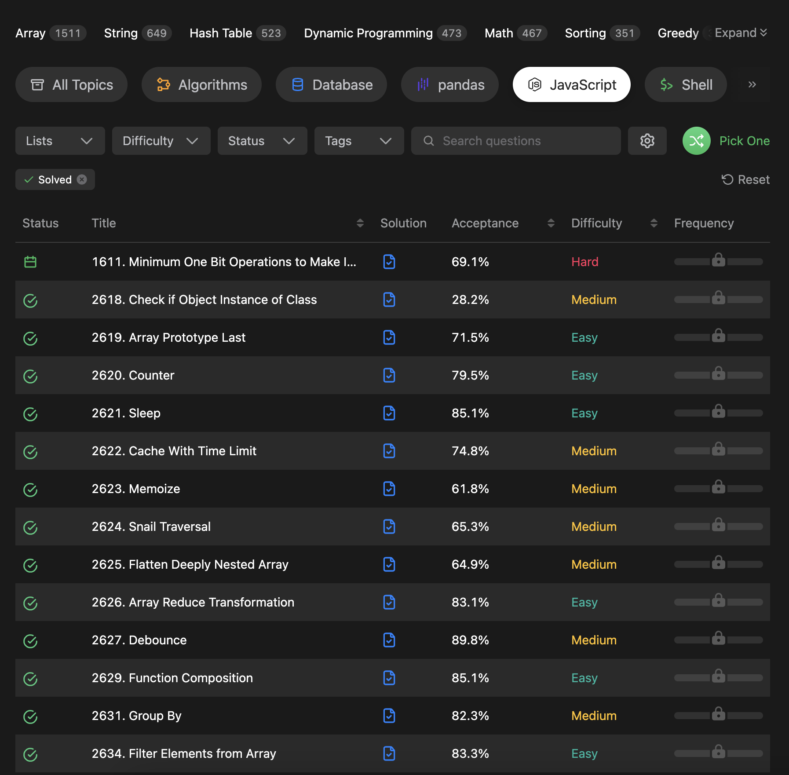

# leetcode javascript 練習紀錄

## 題目

11 月空擋，幾天大概做了近 30 題的 easy 和 medium，意外比很多原本 leetcode 的演算題好寫
把物件、陣列、字串、Date、Math、Map 的常用方法掌握，再順便查一下 mdn，應該會容易些~~
不過有些我很少使用到的，像是:

```javascript
Promise.race()

const intervalID = setInterval(...)

clearInterval(intervalID)
```

也有些題目再考遞迴設計、函式閉包、prototype 原型概念..等等  
最後，還可以看一下討論串裡很多人提供的解答和自己的寫法對比一下~~

[link](https://leetcode.com/problemset/javascript/?status=AC&page=1)


