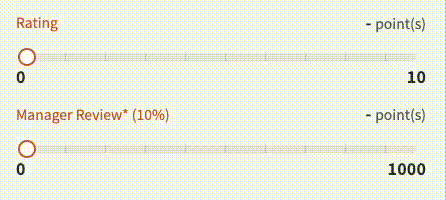

# 分數滑動選取條

## 需求如下

1. 可以拖滑改變分數
2. 依據分段數，在選取條上切分出刻度
3. 滑動時對應的刻度移動要能有段落感
4. 滑動時進度和光暈效果

## props 設計

| name                   | type        | desc                              |
| ---------------------- | ----------- | --------------------------------- |
| v-model                | Number      | 當前滑動到的分數                  |
| score                  | ScoreObject | start 為起始分數 , end 為結束分數 |
| oneHundredPercentScore | Boolean     | true 時，可依照滑動百分比停留     |

## 製作結果



⬇⬇⬇⬇⬇⬇

```html
<div class="w-410px mb-4">
  <cm-score-bar2
    v-model="score3"
    :score="{
        start: 0,
        end: 10,
    }"
  />
</div>

<div class="w-410px mb-4">
  <cm-score-bar2
    labelText="Manager Review* (10%)"
    v-model="score4"
    :score="{
        start: 0,
        end: 1000,
    }"
    oneHundredPercentScore
  />
</div>
```
