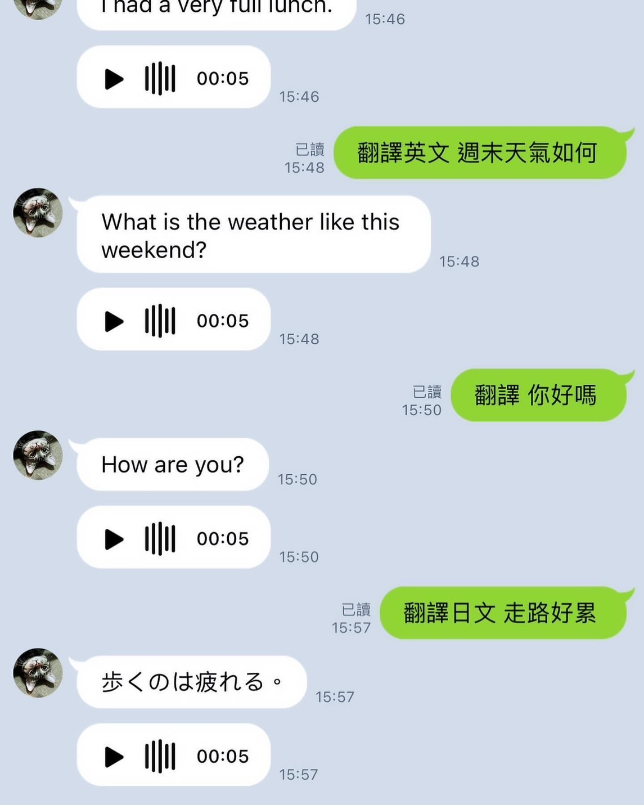

# 2023 Q4 🦉

Q4 開始後，日漸把重心回到工作任務當中，從 vue2 遷移到 vue3，並沒有特別的不適應，因為從 2022 年時還在前公司就開始使用，算超前部署吧！

下一階段的目標，就是開始接手一些後端維護和小功能的開發，很幸運我這組後端是使用 nodejs，這讓我看程式和架構都還多了幾分親切感。會想往後端開發走，應該是現在接觸的專案需求，前端能再拓展的深度，並不會這麼明顯。

雖然還是有些待研究的題目，像是：如何讓客戶端能離線使用，像 App 般的操作，前端可以使用 PWA 配置來處理，又或是如何使用新打包工具 vite 來優化效能，都有很多文章或技巧可以學習，但做應用開發終究不想只侷限在前端範疇，我感覺是還有力氣想多折騰 XD...

## 準備期 🐼🐼

其實從去年開始，我早就有這個念頭想往後端開發去做，再加上最近接觸 openAI 的服務，做了一個翻譯文字再產出語音檔的對話功能，這大概中間的很多環節，包含服務建立、設定檔配置、DB 連線、部署環境和工具的研究..等等，都是日漸累積下來的，示意圖如下，雖然還有些小 bug，但有空再優化嘍...

## 平衡方式 🐣🐣

為了使身心能保持健康，上個月去了趟日本福岡，第一次使用公司福利，便宜的員工機票真是太·幸·福·啦~! 下個月要去大阪，應該明年有機會把日本所有航點給去一遍吧！XDD

