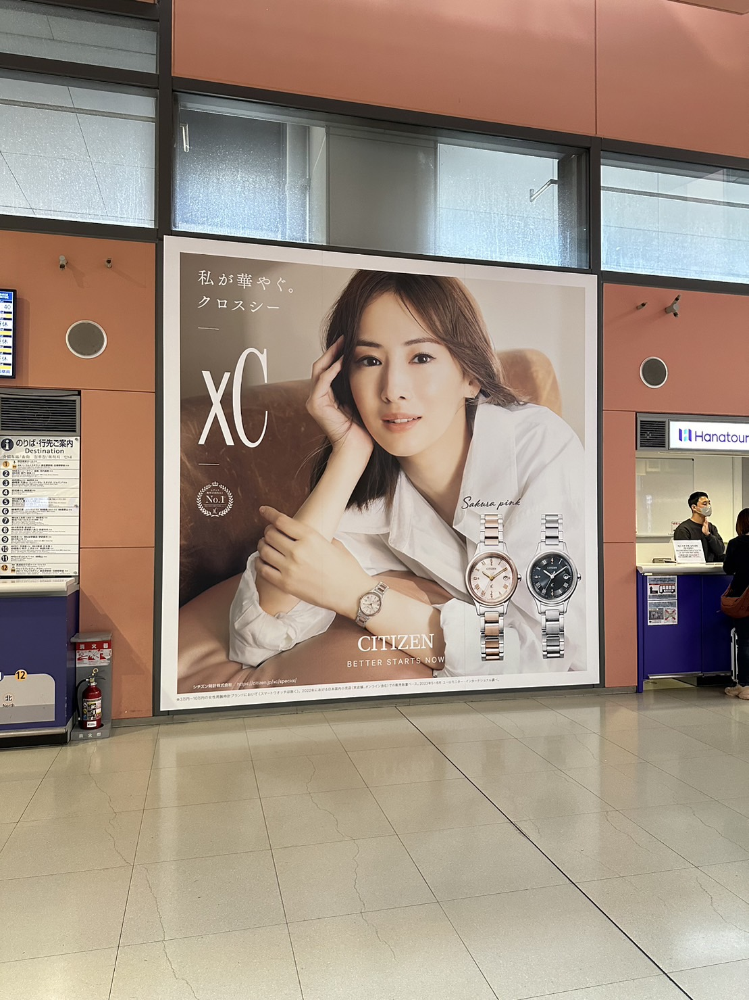
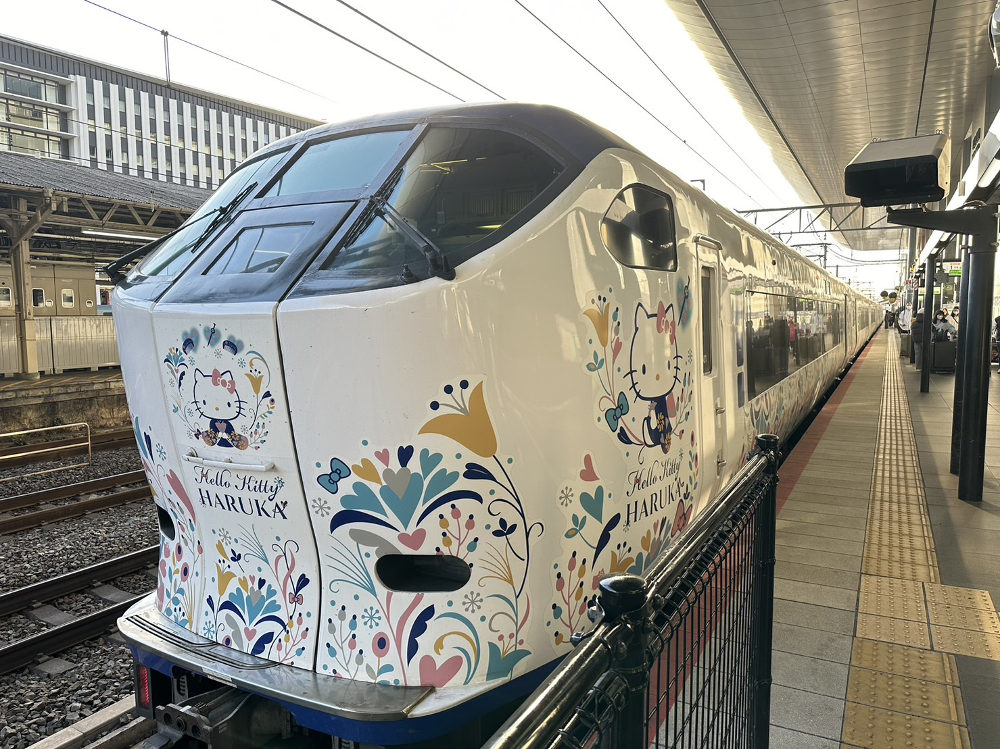
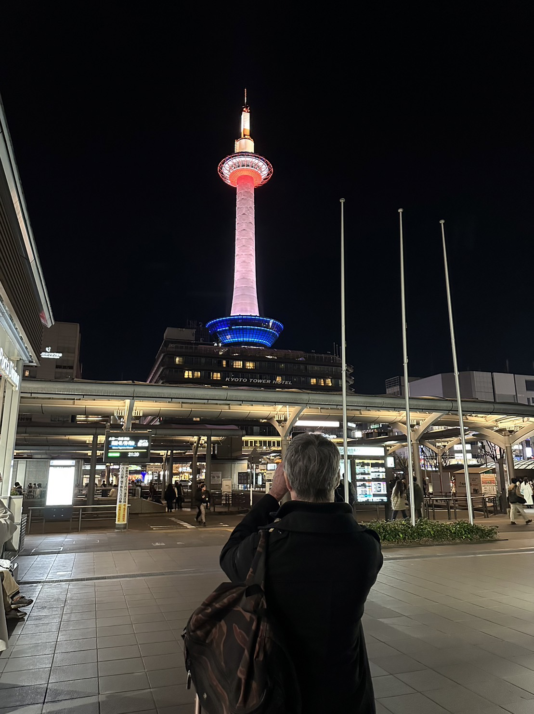
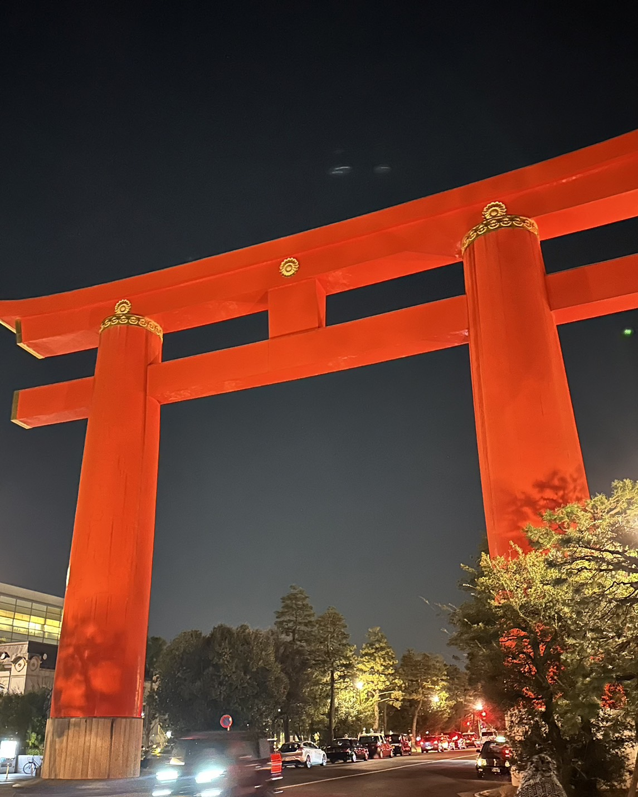
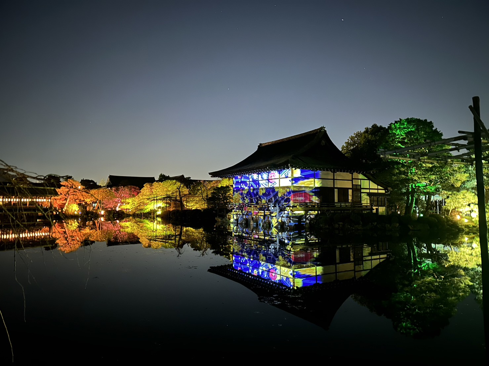
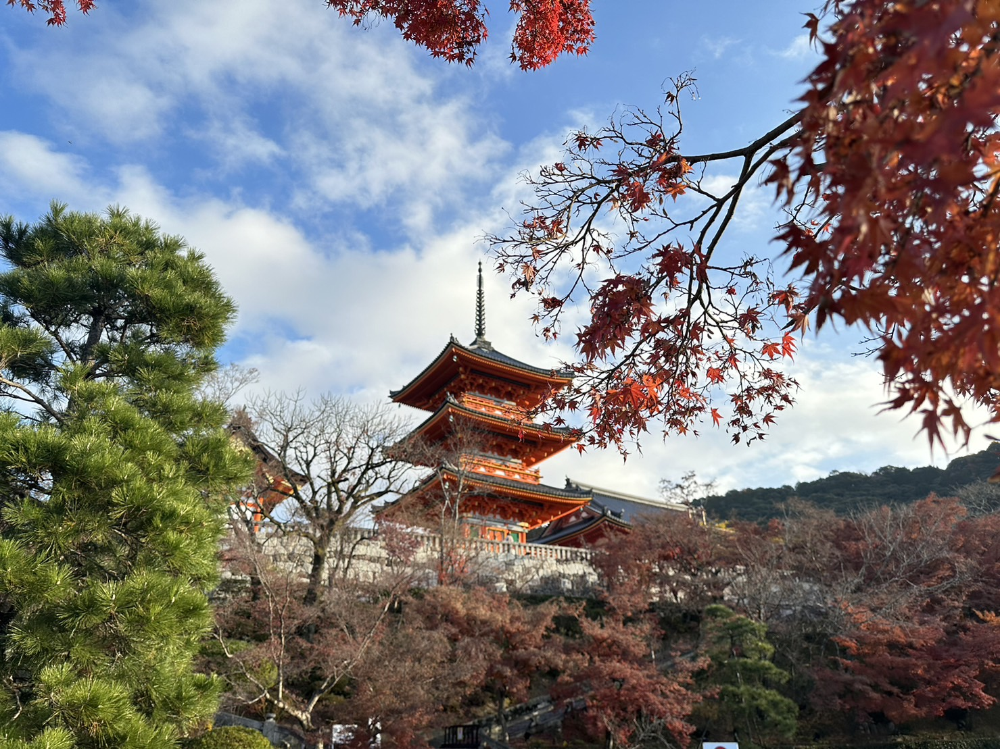
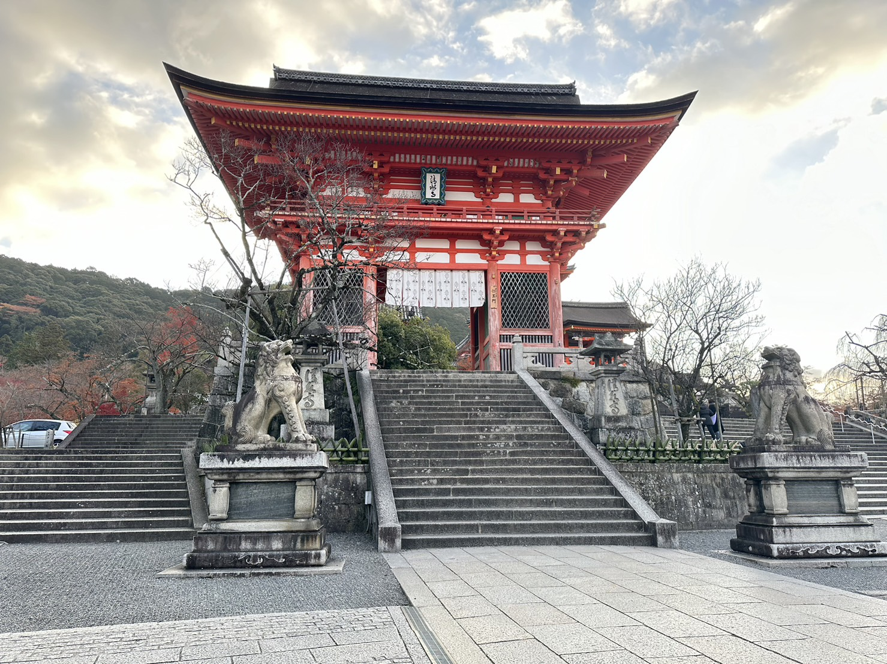
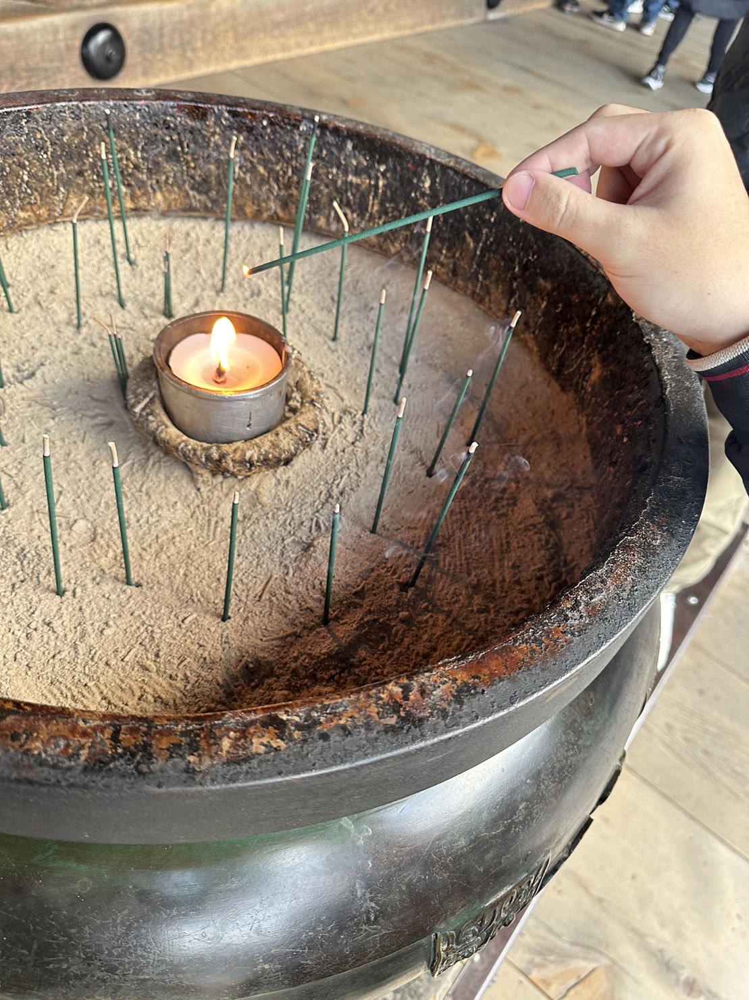
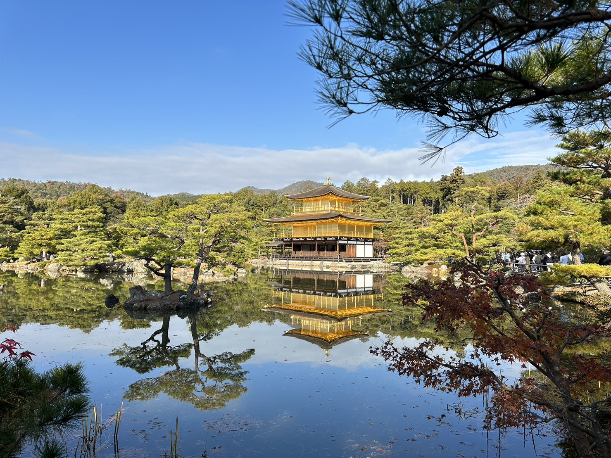
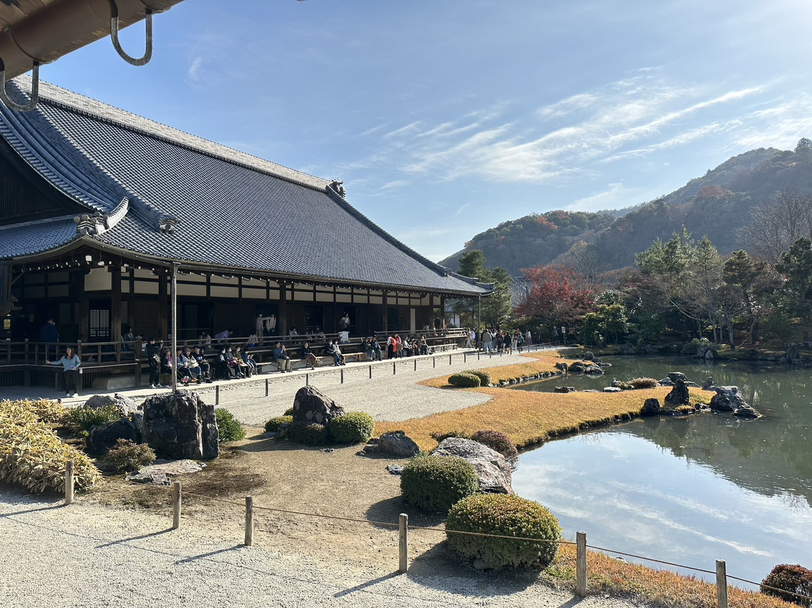

# 京都旅遊

12/8/2023~12/12/2023

## 抵達關西機場

北川景子 =///=

<Flexbox wrap='no-wrap' gap='10px' class='imgMax my-2'>

</Flexbox>

## 前往京都

Heroku 列車 京都塔

<Flexbox wrap='no-wrap' gap='10px'>

</Flexbox>

<Flexbox wrap='no-wrap' gap='10px'>

</Flexbox>

## 第一站 平安神宮 夜景

<Flexbox wrap='no-wrap' gap='10px'>

</Flexbox>

## 第二站 清水寺

<Flexbox wrap='no-wrap' gap='10px'>

</Flexbox>

<Flexbox wrap='no-wrap' gap='10px'>

</Flexbox>

## 第三站 金閣寺

<Flexbox wrap='no-wrap' gap='10px'>

</Flexbox>

## 第四站 嵐山天龍寺

<Flexbox wrap='wrap' gap='10px'>

</Flexbox>

 其他還去了二條城、銀閣寺、逛了大葉高島屋，早上走到鴨川散步 

 整個京都是給人一個很舒適的感覺~~  

