

# 桃園旅遊

## 大溪玫瑰左岸莊園

特色:**餐點好吃**、**價位中高(加服務費)**，另有住宿服務，希望下次去住看看~~!

<Flexbox wrap='no-wrap' gap='10px'>

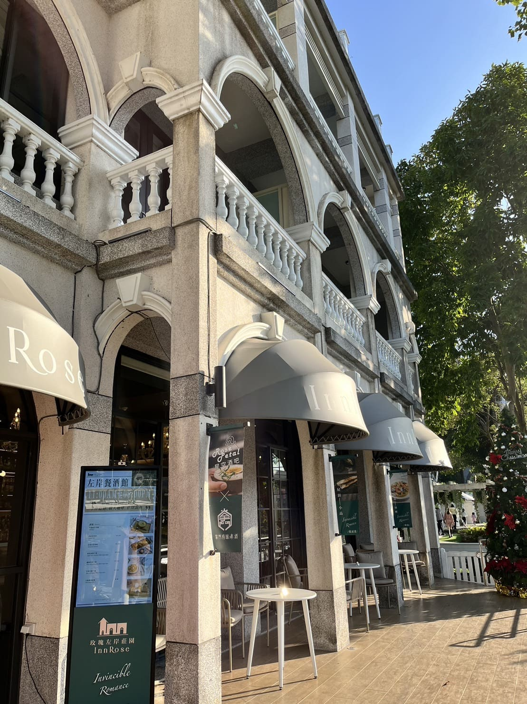

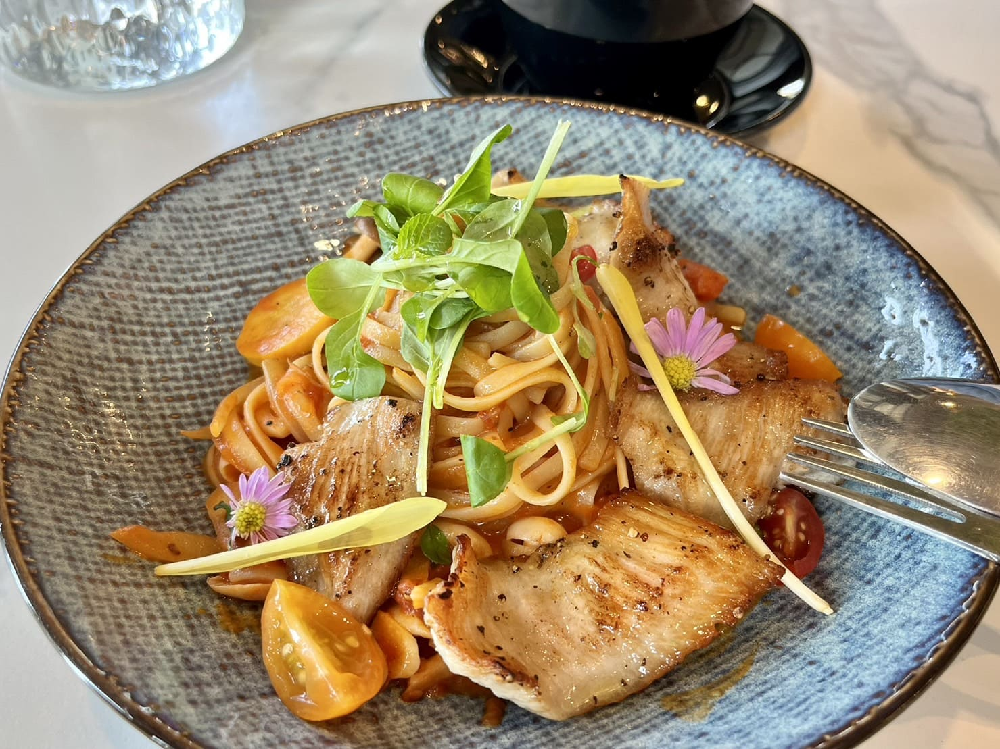

</Flexbox>

## 大鶯綠野景觀自行車道

特色:鶯歌-大溪之間的腳踏車道，單趟騎乘約 40-50 分鐘。沿途會經過中庄蓄水池，風景不錯。最後會抵達大溪老街~

<Flexbox wrap='no-wrap' gap='10px'>

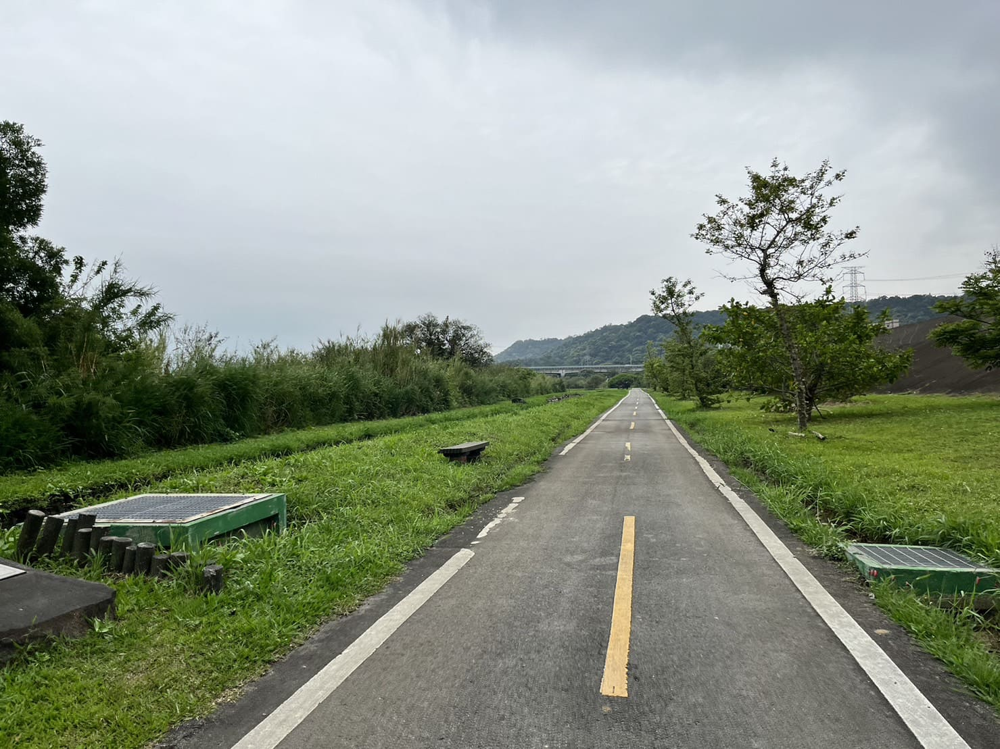

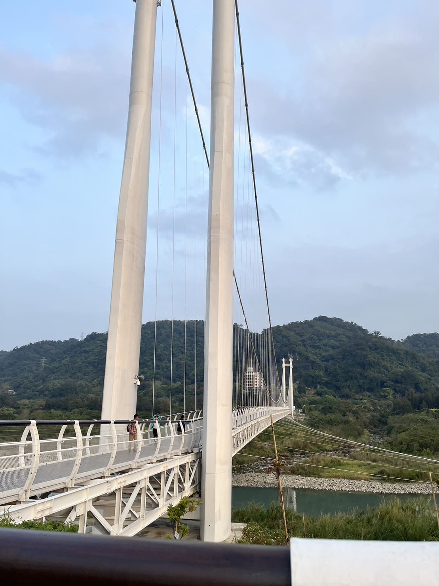

</Flexbox>

<Flexbox wrap='no-wrap' gap='10px'>

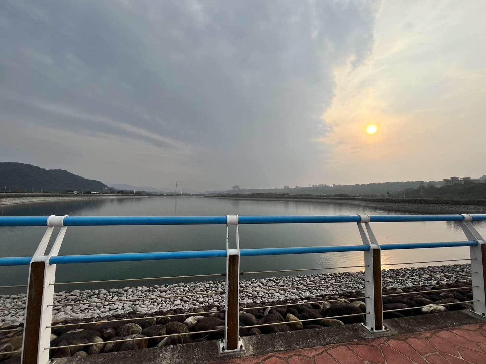

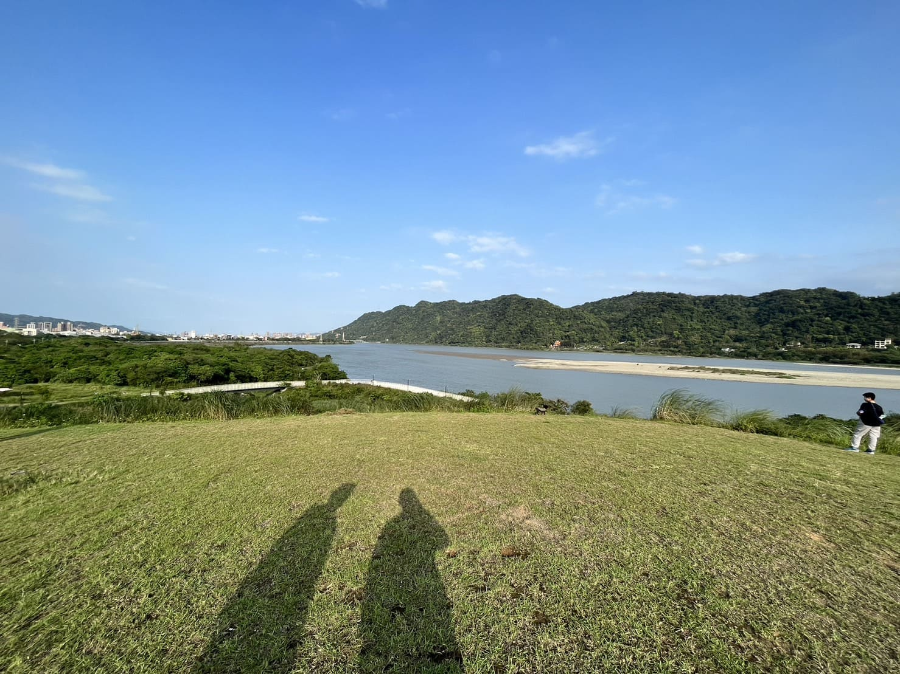

</Flexbox>

## 大溪老街

特色:很多賣豆乾的，但沒有特別推薦，反而是老街周圍的小吃店、熱炒很棒!整體來說，**物美價廉**，**東西好吃**!

<Flexbox wrap='no-wrap' gap='10px'>

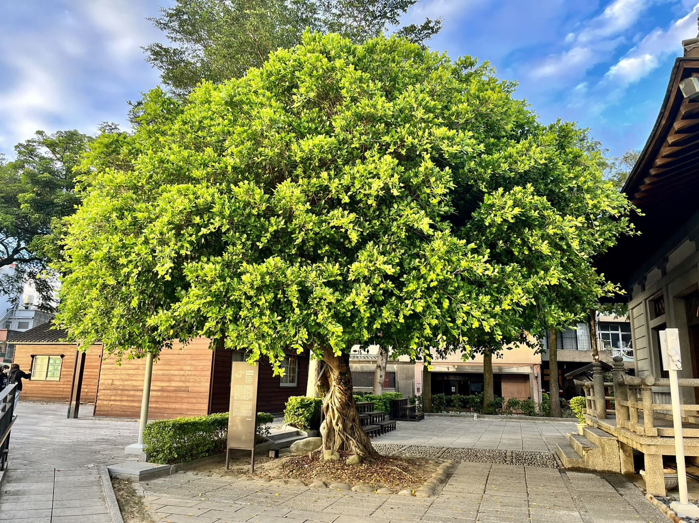

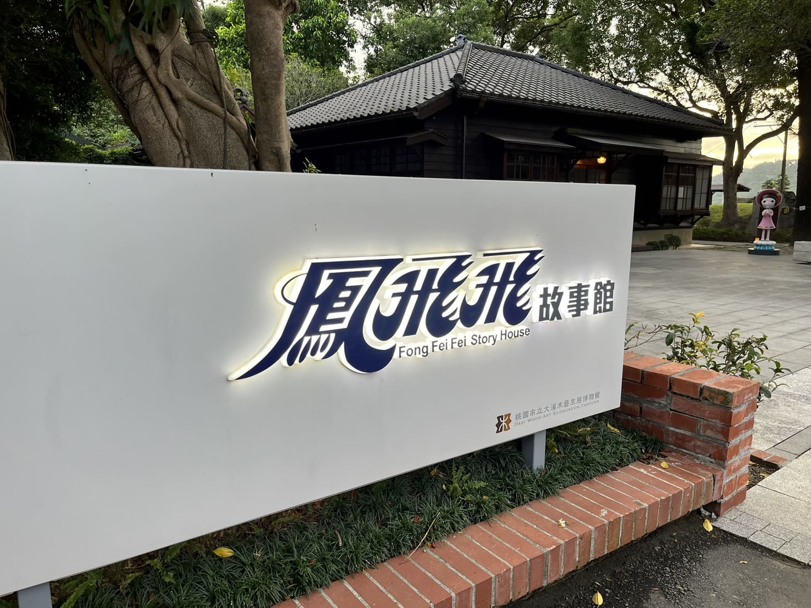

</Flexbox>

<Flexbox wrap='no-wrap' gap='10px'>

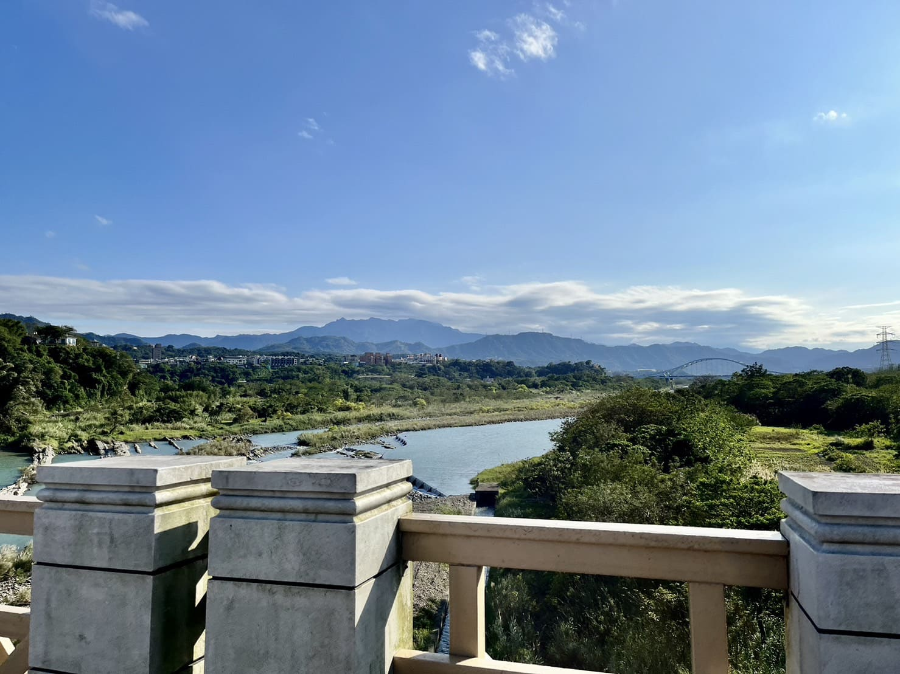

</Flexbox>

## 富田花園農場

特色:這裡可以近距離跟動物互動，門票印象中是 200 元，工作人員說貓咪有些是附近的浪浪，越來越多...XD! **可以帶個罐罐!**

<Flexbox wrap='no-wrap' gap='10px'>

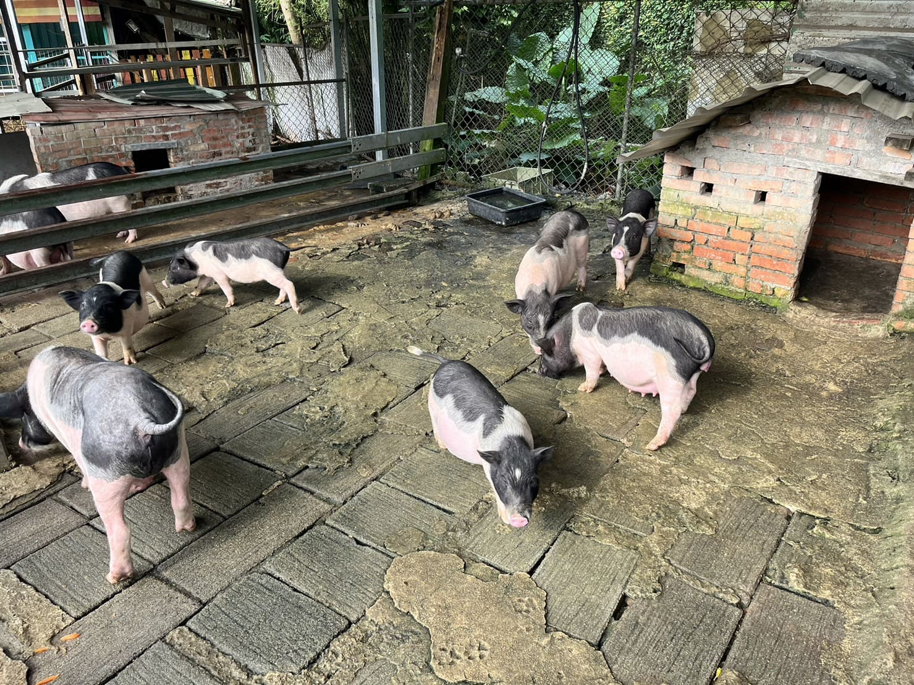

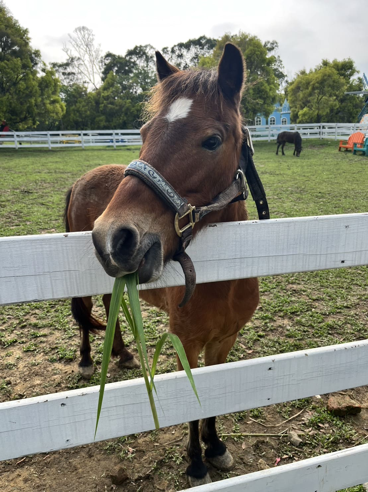

</Flexbox>

<Flexbox wrap='no-wrap' gap='10px'>

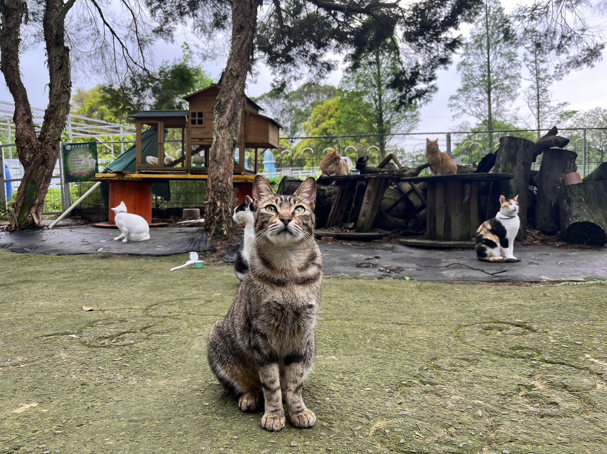

</Flexbox>

## 百吉步道

特色:鄰近慈湖後門的路口，感覺環境都有專人維護，走起來不累，有看到涼亭旁的小路山友留的訊息，寫「**日出很美!**」

<Flexbox wrap='no-wrap' gap='10px'>

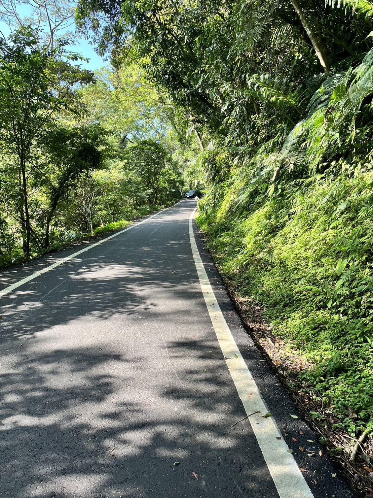

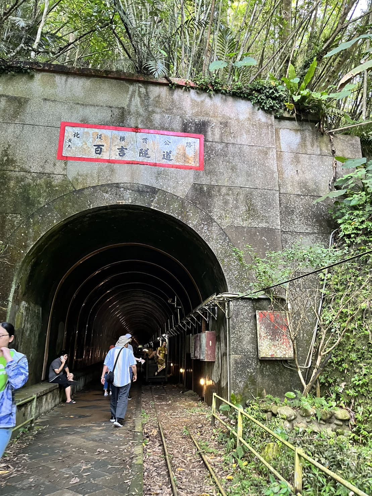

</Flexbox>

