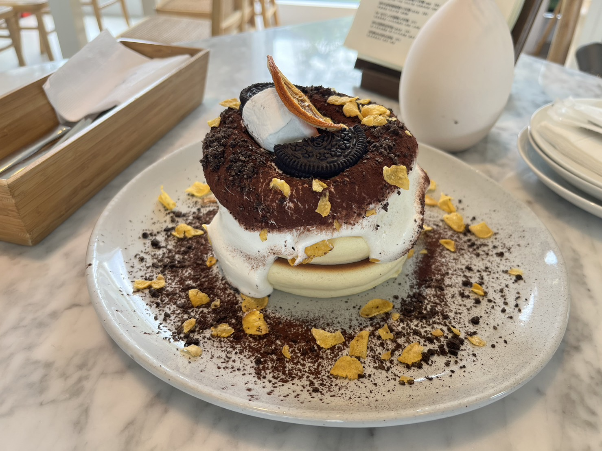
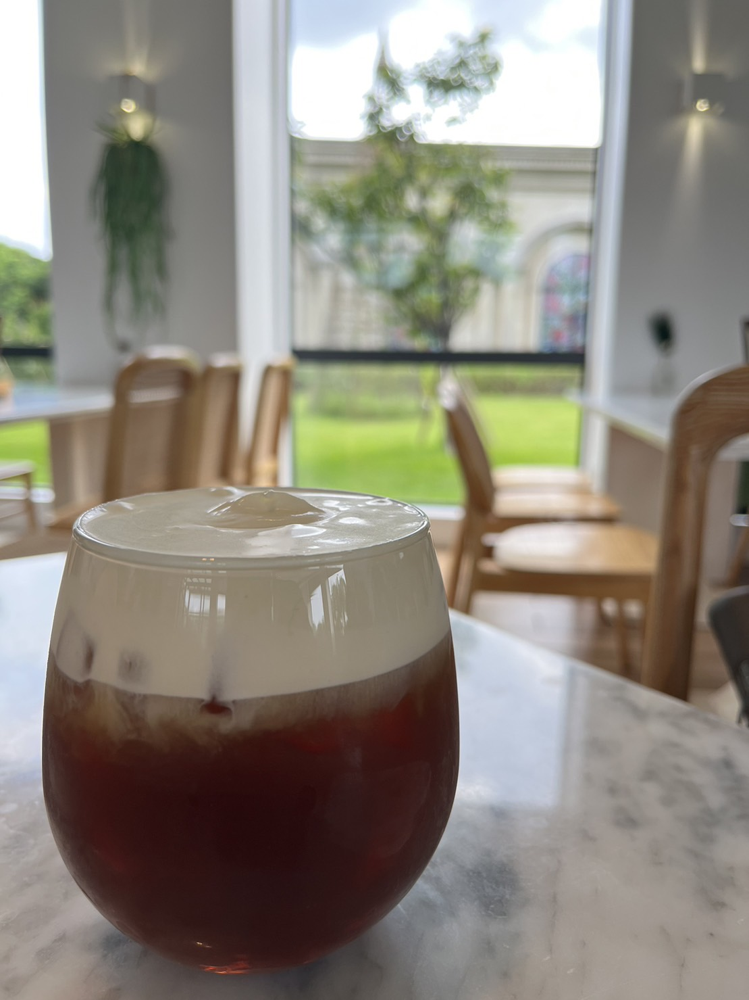
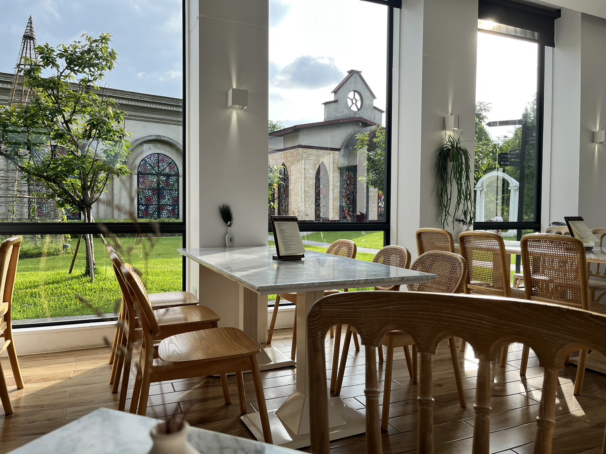

# 桃園旅遊

## 來來米干

桃園市中壢區龍平路 203 號  
特色：湯頭順口，泡菜小辣，巴巴絲口感不錯~! 當天太餓，吃完才想起來沒拍照~XD

## Honeywood Cafe

桃園市平鎮區復旦路四段 116 巷 51 號  
特色：點了提拉米蘇舒芙蕾、拿鐵和紅茶奶蓋，價位適中，東西還不錯~~

<Flexbox wrap='no-wrap' gap='10px'>

</Flexbox>

<Flexbox wrap='wrap' gap='10px'>

</Flexbox>

