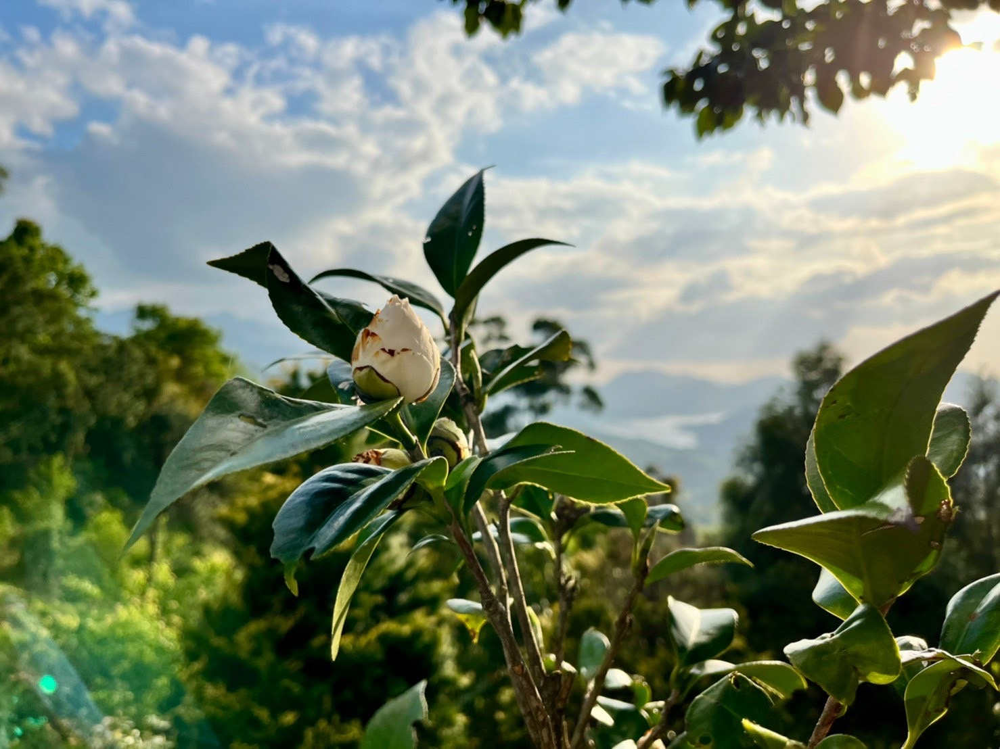
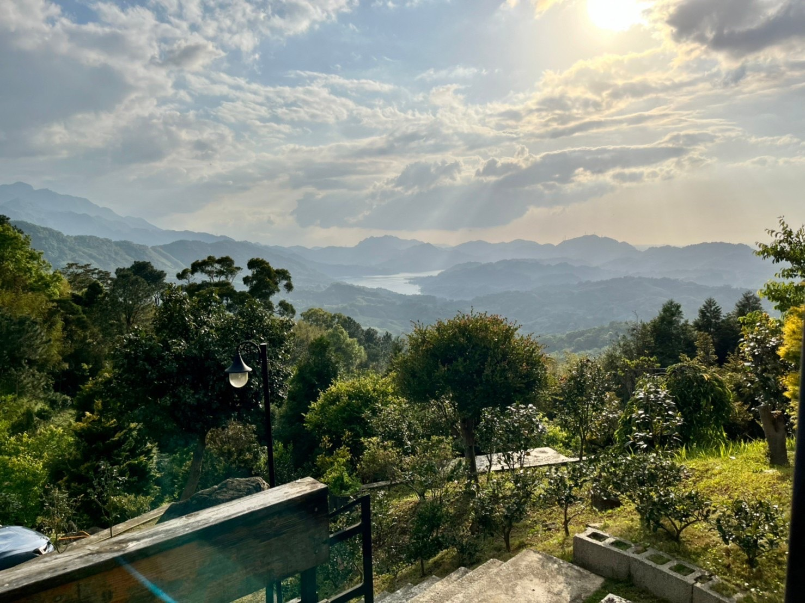
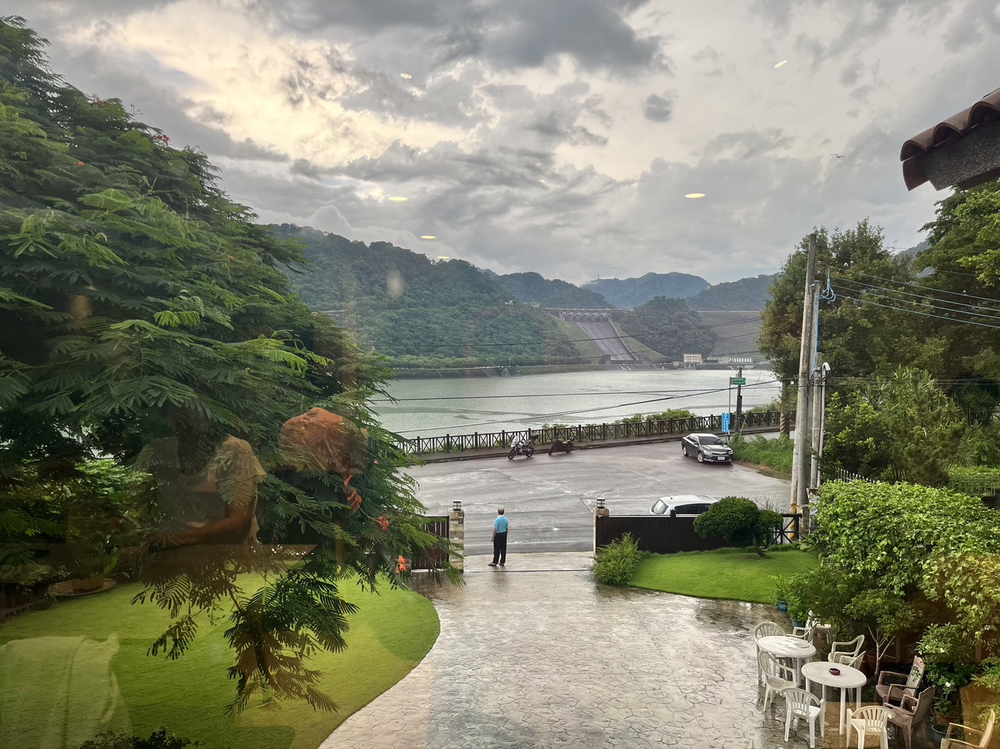
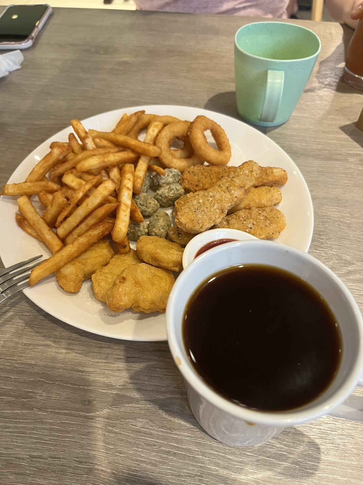

# 桃園旅遊

## 來來米干

桃園市中壢區龍平路 203 號  
特色：湯頭順口，泡菜小辣，巴巴絲口感不錯~! 當天太餓，吃完才想起來沒拍照~XD

## Honeywood Cafe

桃園市平鎮區復旦路四段 116 巷 51 號  
特色：點了提拉米蘇舒芙蕾、拿鐵和紅茶奶蓋，價位適中，東西還不錯~~

<Flexbox wrap='no-wrap' gap='10px'>

</Flexbox>

<Flexbox wrap='wrap' gap='10px'>

</Flexbox>

## 一山咖啡

33642 桃園市復興區三鄰丸山 21 之 5 號  
很適合去看風景，視野很棒!

<Flexbox wrap='wrap' gap='10px'>

</Flexbox>

<Flexbox wrap='no-wrap' gap='10px'>

</Flexbox>

## 石門水庫 尼爾瓦特咖啡

325 台灣桃園市龍潭區龍源路大平段 690 巷 105 號  
特色：視野角度可以仰望石門水庫，餐點還可，單價中。有經過可以考慮，非必去~

<Flexbox wrap='no-wrap' gap='10px'>

</Flexbox>

