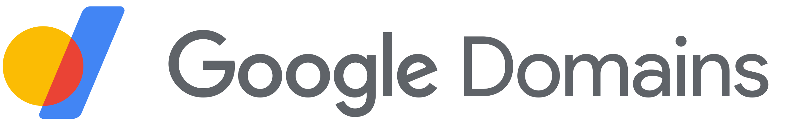
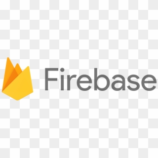

# 使用Google開發者全家桶

<Flexbox wrap='no-wrap' gap='20px'>

</Flexbox>

從去年開始累積前端作品，還要讓作品能部署上線，期間陸續用了許多Google面向開發者的產品在自己練習的專案，包含:

- Google Domain    
  用來買自己網域，並透過DNS設定，把github page指給自己的網域使用
- Google Analytics     
  陸續把練習的nuxt3、vuepress2的練習專案，埋設了Analytics的設定，讓我能從後台直接看到網頁瀏覽量
- Google Firebase      
  在開設專案後，最常使用當中的Hosting服務，可以和github page一樣很快把練習成果部署上線
  但Firebase強大的功能，還像是Auth服務，能讓前端在沒有後端的情況下做註冊/登入等功能
- Google Cloud     
  建立nodjs express專案後，實際要運行需要部署到服務器上，我使用這產品來託管應用

像是Google Firebase和Google Cloud有提供各自的CLI工具，對照官方文件的使用方式，並不會太難理解
此外，可以很方便用一個Google帳號就進入這些服務的後台，算是相當方便

如果是以專案練習和準備作品的角度，使用這些服務可以省下不少要去搞懂怎麼管機器、設定的心智負擔。因此可以把專注力都留在原本想練習的技術上，提供大家參考~~

